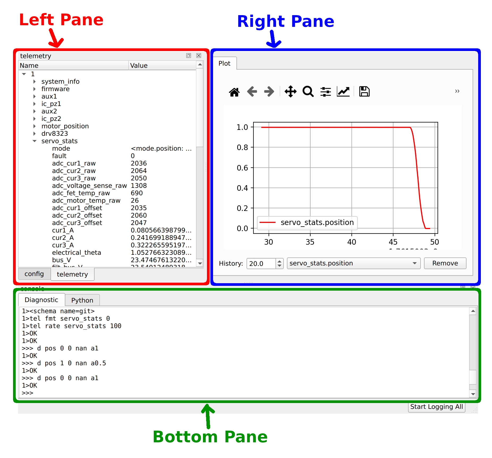

# Software Installation

This guide covers installing the software tools needed to communicate with and configure your moteus controller.

## Installing moteus_gui

The moteus_gui package provides essential tools including `tview` (telemetry viewer) and `moteus_tool` (configuration utility). Installation varies slightly by platform.

=== "Linux"

    ```bash
    python -m pip install moteus-gui
    ```

    **Note**: On Linux, you may need to use either a [virtual environment](https://docs.python.org/3/library/venv.html#creating-virtual-environments) or the `--break-system-packages` option.

    **fdcanusb udev rules**: If using the fdcanusb or mjcanfd-usb-1x adapter, you may need to set up udev rules so regular users can access the device. Follow the instructions at: [https://github.com/mjbots/fdcanusb/blob/master/70-fdcanusb.rules](https://github.com/mjbots/fdcanusb/blob/master/70-fdcanusb.rules)

=== "Windows"

    ```bash
    python -m pip install moteus-gui
    ```

    **Note**: On some older Windows installations, you need to invoke python as `python3`, not `python`.

=== "macOS"

    ```bash
    python -m pip install moteus-gui
    ```

=== "Raspberry Pi (cmdline only)"

    ```bash
    python -m venv moteus-venv --system-site-packages
    ./moteus-venv/bin/pip install moteus

    ```

    **Note**: For complete Raspberry Pi setup instructions including GUI and hardware configuration, see [Raspberry Pi Setup](../platforms/raspberry-pi.md).

## Running tview

tview is the primary tool for configuring and inspecting the state of your moteus controller. Launch it with:

```bash
python3 -m moteus_gui.tview
```

**Alternative**: Your pip installation may have added a `tview` script to your PATH, which you can use instead.

## Understanding tview

tview has three main panes: left, right, and bottom.



### Left Pane Tabs

The left pane contains two tabs:

**Right tab (default)**: Shows a hierarchical tree of all telemetry items currently being reported by the controller.

**Left tab**: Shows a hierarchical tree of all configurable parameters. You can update parameter values by double-clicking on their value and entering a new one.

### Right Pane

The right pane displays real-time plots of telemetry items. You can populate it with plots by right-clicking on telemetry items in the telemetry tab (left pane, right tab).

### Bottom Pane

The bottom pane contains two tabs:

**Left tab - console (default)**: a command line console showing the moteus diagnostic protocol.  It:

- Shows commands sent internally by tview and their responses
- Provides an interactive console to interact with the device using the [diagnostic protocol](../protocol/diagnostic.md)

**Right tab - Python**: A python REPL that can be used to interact with the the controller(s) using the moteus python library.

## Next Steps

Now that you have the software installed and understand the tview interface, proceed to the [Configuration](configuration.md) guide to set up your moteus controller for your specific motor and application.
